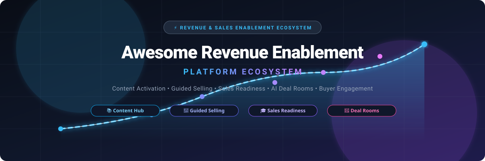

<p align="center">
  
</p>

# 🚀 Awesome Revenue Enablement Platform Ecosystem

<p align="center">
  <a href="https://github.com/ishandutta2007/Awesome-Awesome-Awesome"></a>
  <a href="https://discord.gg/jc4xtF58Ve"></a>
  <a href="https://github.com/ishandutta2007/Awesome-Revenue-Enablement-Platform/stargazers"></a>
  <a href="https://github.com/ishandutta2007/Awesome-Revenue-Enablement-Platform/network/members"></a>
  <a href="https://github.com/ishandutta2007/Awesome-Revenue-Enablement-Platform/blob/main/LICENSE"></a>
  <a href="https://github.com/ishandutta2007"></a>
</p>

---

**A comprehensive, curated directory of enterprise SaaS products & open-source GitHub projects for modern Revenue Enablement & Sales Enablement.**  
*Empowering revenue operations, marketing content teams, sales leadership, and enablement managers with sales content management, guided selling playbooks, AI-driven pitch coaching, digital sales rooms (DSR), and buyer engagement analytics.*

📅 **Last updated: September 2026**

---

## 🔍 Overview & SEO Highlights

**Revenue Enablement** (also widely known as **Sales Enablement**) bridges the critical gap between marketing strategy, content operations, seller readiness, and buyer execution. Modern revenue enablement platforms provide go-to-market (GTM) teams with contextual collateral recommendations, automated content governance, interactive buyer deal rooms, structured onboarding paths, and AI-assisted coaching simulations.

### 🎯 Core Capabilities Tracked:
- 📚 **Sales Content Management (CMS) & Digital Asset Governance**: Centralized repositories, AI search, version control, CRM-embedded recommendations, and compliance enforcement.
- 🎯 **Guided Selling & Dynamic Playbooks**: In-workflow playbooks, buyer persona battlecards, interactive pitch decks, and deal stage guidance.
- 🎓 **Sales Readiness, Training & Onboarding**: Microlearning modules, competency scorecards, video-based role-plays, and automated certification tracks.
- 🤖 **AI Pitch Coaching & Conversation Intelligence**: Real-time sales speech coaching, call scoring, AI persona simulations, and objection-handling analysis.
- 🤝 **Digital Sales Rooms (DSR) & Buyer Engagement**: Secure prospect microsites, mutual action plans (MAP), multi-stakeholder collaboration, and page-level reading telemetry.
- 📊 **Content ROI & Attribution Analytics**: Tracking which decks, case studies, and proposals correlate with closed-won pipeline velocity.

---

## 📑 Table of Contents

- [🏢 SaaS/Hosted Platforms](#-saashosted-platforms)
- [💻 Open-Source GitHub Projects](#-open-source-github-projects)
- [🏗️ Architecture & Custom Build Frameworks](#️-architecture--custom-build-frameworks)
- [📈 Star History](#-star-history)
- [🤝 How to Contribute](#-how-to-contribute)
- [⚠️ Disclaimer](#️-disclaimer)

---

## 🏢 SaaS/Hosted Platforms

> 📊 **Market Size & Sector Dynamics**: The global Revenue Enablement and Sales Enablement platform market is valued at approximately **$3.8B–$4.5B (2025–2026)** and is projected to expand to **$11.8B–$14.2B by 2032** at a compound annual growth rate (CAGR) of **~18.5–20.8%**. The sector is **moderately concentrated at the top enterprise tier**—dominated by titans Highspot and Seismic alongside Showpad and Mindtickle—yet exhibits **moderate fragmentation across the mid-market and digital sales room (DSR) niches**, where specialized buyer-enablement suites (Dock, Trumpet, Paperflite) and just-in-time micro-learning engines (Spekit) thrive and resist a simple winner-take-all monopoly.

The table below is sorted in **descending order by company size** (market valuation or latest enterprise scale / revenue):

| Platform | Company Size (Valuation / Revenue) | Key Focus & Capabilities | Pricing (Starting Tier) | Free Tier / Free Trial Limits |
| :--- | :--- | :--- | :--- | :--- |
| **[Highspot](https://www.highspot.com/)** | **~$3.5 Billion Valuation**<br>(~$175M+ ARR, Series F, $648M raised) | Category-defining revenue enablement platform uniting AI content governance, guided selling playbooks, sales training, coaching, and buyer analytics. | Starts at **~$45/user/mo** *(Equip & Engage tier; billed annually; typical enterprise entry commitment starts around $20,000–$25,000/yr)* | **No free-forever tier**; offers a **14-day guided sandbox pilot** provided following sales demonstration and enterprise qualification. |
| **[Seismic](https://seismic.com/)** | **~$3.0 Billion Valuation**<br>(~$300M+ ARR, Series G, $440M raised) | Enterprise enablement cloud delivering automated content governance, dynamic pitch personalization, Seismic Learning, and Aura AI analytics. | Starts at **~$32/user/mo** *(Core Enablement tier; billed annually; entry platform commitments typically start at ~$20,000–$25,000/yr)* | **No free-forever tier**; offers a **14-day guided proof-of-concept (POC) sandbox** available upon consultation and enterprise scoping. |
| **[Showpad](https://www.showpad.com/)** | **~$1.2 Billion Valuation**<br>(~$120M+ Combined ARR, merged with Bigtincan) | Sales enablement and content activation platform supporting guided selling, interactive buyer engagement spaces (Shared Spaces), and hybrid field sales. | Starts at **~$35/user/mo** *(Essential / Professional tier; billed annually; typically requires a 10-seat minimum / ~$4,200/yr)* | **No free-forever tier**; offers a **14-day interactive guided trial** available upon request through personalized sales demo. |
| **[Mindtickle](https://www.mindtickle.com/)** | **~$1.2 Billion Valuation**<br>(~$70M ARR, Series E Unicorn, SoftBank) | Sales readiness and revenue enablement platform featuring role-based onboarding, AI coaching simulations, Call AI conversation intelligence, and digital sales rooms. | Starts at **~$30/user/mo** *(Readiness Core tier; billed annually; starting contract minimums typically ~$25,000/yr)* | **No free-forever tier**; offers a **14-day sandbox proof-of-concept trial** provisioned following enterprise scoping and demo. |
| **[Allego](https://www.allego.com/)** | **~$400M–$500M Valuation**<br>(~$60M ARR, backed by growth equity) | Revenue enablement suite unifying sales readiness, bite-sized video coaching, content management, and conversation intelligence into an integrated suite. | Starts at **~$25/user/mo** *(Readiness & Content entry package; billed annually; typical entry minimum starting at ~$15,000/yr)* | **No free-forever tier**; offers a **14-day guided proof-of-concept sandbox** with sample coaching and content modules upon sales demo qualification. |
| **[Mediafly](https://www.mediafly.com/)** | **~$350M–$450M Valuation**<br>(~$50M ARR, acquired InsightSquared) | Value-selling and revenue enablement platform combining content management, interactive ROI calculators, deal intelligence, and buyer room microsites. | Starts at **~$25/user/mo** *(Content & Value enablement tier; billed annually; entry platform starting at ~$16,000/yr)* | **No free-forever tier**; offers a **14-day personalized sandbox evaluation** provided after discovery demo and technical qualification. |
| **[Bigtincan](https://www.bigtincan.com/)** | **~$250M–$350M Valuation**<br>(~$70M+ ARR, merged into Showpad group) | AI-driven sales enablement automation suite managing content distribution, interactive 3D presentations, virtual deal rooms, and mobile seller training. | Starts at **~$25/user/mo** *(Core Content & Hub tier; billed annually; entry platform commitments typically starting at ~$15,000/yr)* | **No free-forever tier**; offers a **14-day sales-guided pilot / POC sandbox** provisioned upon demo request and evaluation. |
| **[Brainshark](https://www.brainshark.com/)** | **~$200M–$300M Valuation**<br>(~$40M ARR, acquired by Bigtincan for $205M) | Sales readiness and training software offering video-based coaching, automated practice assessments, content authoring, and Salesforce-embedded scorecards. | Starts at **$83/user/mo** *(Pro plan; billed annually; typically requires 20-seat minimum; Salesforce add-on edition starts at $5/user/mo)* | **No free-forever tier**; offers a **14-day guided proof-of-concept sandbox** provided upon sales consultation. |
| **[Spekit](https://www.spekit.com/)** | **~$200M–$250M Valuation**<br>(~$15M ARR, Series B, $60M raised) | Just-in-time revenue enablement and digital adoption platform embedding contextual training, playbook snippets, and guidance directly inside CRM workflows. | Starts at **~$15/user/mo** *(Core / Lite tier; billed annually; entry team contracts starting around $6,000/yr)* | **No free-forever tier**; offers a **14-day guided proof-of-concept sandbox** provisioned upon sales demonstration. |
| **[ClearSlide](https://www.clearslide.com/)** | **~$150M–$200M Valuation**<br>(~$35M ARR, part of Bigtincan suite) | Sales engagement and enablement system providing integrated pitch presentation decks, viewer analytics, and screen sharing for remote selling teams. | Starts at **~$35/user/mo** *(Viewer / Standard plan; billed annually)* | **No free-forever tier**; offers a **14-day free trial** with full access to pitch decks, presentation viewer, and tracking analytics upon registration. |
| **[SalesHood](https://saleshood.com/)** | **~$100M–$150M Valuation**<br>(~$18M ARR, $30M total raised) | AI-powered sales enablement platform providing structured learning paths, collaborative deal coaching, AI pitch role-playing, and client microsites. | Starts at **$45/user/mo** *(Essential plan; billed annually; Pro tier starts at $75/user/mo)* | **No free-forever tier**; offers a **14-day free trial** ("Try Before You Buy" program including full access to AI pitch practice, coaching modules, and content libraries; no credit card required). |
| **[Paperflite](https://www.paperflite.com/)** | **~$60M–$80M Valuation**<br>(~$7M ARR, $12M total raised) | Content-centric revenue enablement and buyer engagement platform with content discovery, personalized deal microsites, and page-by-page viewing analytics. | Starts at **$30/user/mo** *(Starter / "I Got Wings" tier; billed annually; minimum 5 users / $1,800/yr; Professional tier at $50/user/mo)* | **No free-forever tier**; offers a **14-day free trial** with full access to content hub, microsites, and real-time engagement analytics (no credit card required). |
| **[Trumpet](https://www.sendtrumpet.com/)** | **~$40M–$60M Valuation**<br>(~$4M ARR, Series A, AlbionVC) | Interactive buyer enablement platform creating personalized digital sales rooms (Pods) with mutual action plans, embedded collateral, and buyer signals. | **Free tier ($0/mo)**; paid Pro tier starts at **$44/user/mo** (or ~£29–£36/user/mo billed annually) | **Permanent Free Tier:** **$0/mo** for up to 10 active Pods per account, unlimited internal users, mutual action plans, and basic analytics (no credit card required). |
| **[Dock](https://www.dock.us/)** | **~$30M–$50M Valuation**<br>(~$3M ARR, Seed, Craft Ventures) | Digital sales room and buyer enablement platform allowing revenue teams to organize mutual action plans, share sales collateral, and track prospect engagement. | **Free tier ($0/mo)**; paid Standard tier starts at **$350/mo** (billed annually) | **Permanent Free Tier:** **$0/mo** for up to 50 active buyer workspaces, unlimited client viewers, basic Slack & Google Drive integrations, no credit card required (14-day trial for paid features). |
| **[Enablix](https://www.enablix.com/)** | **~$15M–$25M Valuation**<br>(~$2M ARR, bootstrapped / angel backed) | Content enablement platform connecting marketing assets, sales decks, and training playbooks across cloud drives, CRM, and communication channels. | Starts at **~$25/user/mo** *(Standard plan; billed annually; platform entry starting at ~$3,000–$6,000/yr)* | **No free-forever tier**; offers a **14-day guided proof-of-concept sandbox** provided upon sales consultation. |

---

## 💻 Open-Source GitHub Projects

Open-source technologies provide versatile building blocks for engineering-led enablement stacks. Below is the curated list of leading open-source repositories powering workflow automation, modern CRM foundations, LLM agent coaching, documentation playbooks, meeting scheduling, and buyer analytics.

Repositories are **sorted in descending order by GitHub star count**, with a live star count badge linking directly to each project's stargazers:

1. **[n8n](https://github.com/n8n-io/n8n)** [](https://github.com/n8n-io/n8n/stargazers)  
   ⚡ *Fair-code workflow automation engine with 400+ nodes connecting CRMs, email, Slack, and cloud storage to automate sales content distribution, training assignment triggers, and buyer engagement alerts.*

2. **[Twenty](https://github.com/twentyhq/twenty)** [](https://github.com/twentyhq/twenty/stargazers)  
   🌟 *Modern open-source CRM alternative to Salesforce with native AI capabilities, customizable opportunity pipelines, deal room attachment fields, and sales playbook tracking.*

3. **[Flowise](https://github.com/FlowiseAI/Flowise)** [](https://github.com/FlowiseAI/Flowise/stargazers)  
   🤖 *Drag-and-drop UI and orchestration engine for building custom LLM agents, AI sales pitch role-playing bots, and semantic content recommendation assistants.*

4. **[Odoo](https://github.com/odoo/odoo)** [](https://github.com/odoo/odoo/stargazers)  
   💼 *Full-suite open-source ERP and CRM system with native Sales Quotations, Customer Portals, Document Management, and integrated eLearning modules for sales teams.*

5. **[Cal.com](https://github.com/calcom/cal.com)** [](https://github.com/calcom/cal.com/stargazers)  
   📅 *Open-source scheduling infrastructure enabling round-robin buyer routing, qualified demo bookings, and automated calendar-to-CRM meeting coordination.*

6. **[Outline](https://github.com/outline/outline)** [](https://github.com/outline/outline/stargazers)  
   📖 *Fast, collaborative, Markdown-based team knowledge base used to host internal sales methodology playbooks, competitive battlecards, and objection-handling scripts.*

7. **[Novu](https://github.com/novuhq/novu)** [](https://github.com/novuhq/novu/stargazers)  
   🔔 *Open-source communication infrastructure powering multi-channel notifications (in-app, email, Slack, SMS) when prospects open shared collateral or complete onboarding milestones.*

8. **[PostHog](https://github.com/PostHog/posthog)** [](https://github.com/PostHog/posthog/stargazers)  
   🦔 *Product analytics, session replay, and feature flag platform used to measure how prospective buyers interact with self-serve product demos and buyer room microsites.*

9. **[Wiki.js](https://github.com/Requarks/wiki)** [](https://github.com/Requarks/wiki/stargazers)  
   📝 *Modern and extensible open-source wiki software running on Node.js, providing version-controlled documentation, sales onboarding manuals, and asset catalogs.*

10. **[BookStack](https://github.com/BookStackApp/BookStack)** [](https://github.com/BookStackApp/BookStack/stargazers)  
    📚 *Simple, organized documentation platform structured into Books, Chapters, and Pages, commonly utilized by revenue operations for organized seller playbooks.*

11. **[Documenso](https://github.com/documenso/documenso)** [](https://github.com/documenso/documenso/stargazers)  
    ✍️ *The open-source DocuSign alternative for embedding secure document signing, proposal execution, and closing agreements directly into deal rooms.*

12. **[Formbricks](https://github.com/formbricks/formbricks)** [](https://github.com/formbricks/formbricks/stargazers)  
    📋 *Privacy-first open-source survey and experience management suite used to capture buyer feedback, win/loss analyses, and sales training quiz evaluations.*

13. **[Moodle](https://github.com/moodle/moodle)** [](https://github.com/moodle/moodle/stargazers)  
    🎓 *Globally adopted open-source learning management system (LMS) powering structured seller onboarding, competency certifications, and sales curriculum tracking.*

14. **[Pimcore](https://github.com/pimcore/pimcore)** [](https://github.com/pimcore/pimcore/stargazers)  
    📦 *Enterprise Open Source Digital Asset Management (DAM) and Product Information Management (PIM) platform for organizing, tagging, and distributing sales media.*

---

## 🏗️ Architecture & Custom Build Frameworks

```
 ┌─────────────────────────────────────────────────────────────┐
 │                 BUYER ENGAGEMENT & DEAL ROOMS               │
 │    Digital Sales Rooms (Dock, Trumpet) • Documenso Sign     │
 └──────────────────────────────┬──────────────────────────────┘
                                │
 ┌──────────────────────────────▼──────────────────────────────┐
 │              SALES CONTENT & PLAYBOOK FOUNDATION            │
 │   Outline / BookStack / Pimcore DAM OR Highspot / Seismic   │
 └──────────────────────────────┬──────────────────────────────┘
                                │
 ┌──────────────────────────────▼──────────────────────────────┐
 │            COACHING, READINESS & AI SIMULATION              │
 │    Flowise LLM Agents • Moodle LMS • Mindtickle / Allego    │
 └──────────────────────────────┬──────────────────────────────┘
                                │
 ┌──────────────────────────────▼──────────────────────────────┐
 │          CRM CONTEXT & WORKFLOW ORCHESTRATION               │
 │     Twenty / Odoo + n8n Event Triggers + Novu Alerts        │
 └─────────────────────────────────────────────────────────────┘
```

- **Content & Knowledge Repository**: Organize sales decks, competitive battlecards, and objection playbooks using structured open-source wikis (**Outline**, **BookStack**) or enterprise DAMs (**Pimcore**).
- **Core System of Record**: Connect opportunity stages and deal stakeholders with modern open-source CRMs (**Twenty**, **Odoo**) or commercial platforms (**Salesforce**, **HubSpot**).
- **Readiness & AI Coaching**: Build role-play practice agents using **Flowise** and structured onboarding curriculums using **Moodle**.
- **Automation & Distribution**: Orchestrate collateral sharing triggers, lead assignments, and seller activity logging via **n8n** and dispatch real-time alerts with **Novu**.
- **Buyer Experience Layer**: Package collateral into transparent collaborative spaces with **Dock** or **Trumpet** and close proposals with **Documenso**.

---

## 📈 Star History

[](https://star-history.dera.page/#ishandutta2007/Awesome-Revenue-Enablement-Platform&type=date&legend=top-left)

---

## 🤝 How to Contribute

Contributions are welcome! Help us expand and maintain this Revenue Enablement directory:

1. 🍴 **Fork the repository**.
2. ✏️ **Add or update entries** in `README.md` (keep alphabetical, valuation-ranked, or star-ranked order).
3. 📝 **Include key facts**: Product/project name, official link, 1–2 sentence description, exact pricing models, and free trial / free tier terms.
4. 🚀 **Submit a Pull Request** with a concise explanation.

🌟 *Star this repository if you find it valuable for your revenue enablement journey!*

---

## ⚠️ Disclaimer

- This is a **community-curated** resource and does not constitute an endorsement of any particular vendor.
- Revenue enablement software touches internal sales strategy, confidential collateral, and prospect interaction data. Always evaluate data privacy, SOC 2 compliance, and CRM access permissions prior to production adoption.

---

<p align="center">
  <b>Built with ❤️ for Enablement Leaders, Chief Revenue Officers, RevOps Engineers, and GTM Teams.</b><br>
  <sub>Let's make sales enablement content, coaching, and buyer engagement transparent and accessible.</sub>
</p>
